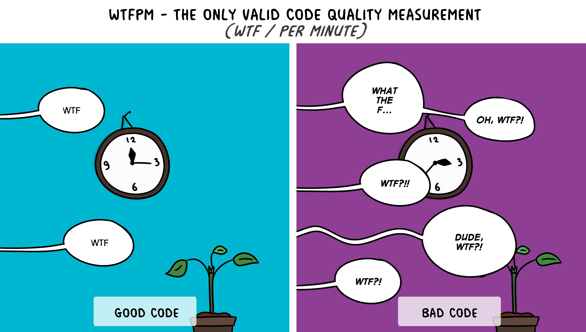

I think code review is one of the best sources of inspiration. I see it as an opportunity to learn new things from 
other software developers sending pull/merge requests. Moreover, sometimes you may need to study a specific subject 
with more details regarding the under review code. Usually, this process leads to a more profound knowledge of that 
domain. However, there's still another fact about code review: after a while, you face some common mistakes. Recently, 
I reviewed a feature in which I saw an **Optional** pitfall. Honestly, I had seen that issue several times in 
different merge requests sent by several developers (from beginners to experienced ones).

I know that there are tonnes of articles regarding Java **Optional** some of which are quite useful like 
[this one](https://dzone.com/articles/using-optional-correctly-is-not-optional) (although I have arguments against some 
of the cases mentioned in the article) by [Anghel Leonard](https://dzone.com/users/196910/anghelleonard.html), the 
author of [Java Coding Problems](https://www.amazon.com/gp/product/B07Y9BPV4W/). I don't want to repeat all of the 
contents you can simply find by googling. I intend to talk about some of the most common and less addressed pitfalls 
regarding **Optional** usage.



## What is Optional?
Before diving into the main subject, let’s review some definitions and see what **Optional** is. As a Java developer, 
you should have encountered the infamous **NullPointerException** that occurs when you're going to access 
a **null** reference. With a quick search, you can find thousands of memes and jokes about null references in Java (and 
other languages as well). **Optional** came in to play in Java 8 to help programmers get rid of all of the problems caused 
by **null** references. Have a look at 
[this article](https://www.oracle.com/technical-resources/articles/java/java8-optional.html), from 
[Oracle technical resources](https://www.oracle.com/technical-resources/), to read more about the motivation of 
**Optional** existence in Java.

Now we are going to have a look at Optional’s 
[JavaDoc](https://docs.oracle.com/en/java/javase/11/docs/api/java.base/java/util/Optional.html) and check the provided 
definition.

> A container object which may or may not contain a non-null value.

Following this introduction, as an API note, there is an answer to the first question that may come to mind: “when 
should we use **Optional**?”

> Optional is primarily intended for use as a method return type where there is a clear need to represent "no result," 
and where using null is likely to cause errors. A variable whose type is Optional should never itself be null; it 
should always point to an Optional instance.

So we can extract the following points from the 
[JavaDoc](https://docs.oracle.com/en/java/javase/11/docs/api/java.base/java/util/Optional.html) descriptions:
+ Optional is a container object.
+ It may not contain a **non-null** value.
+ It is mainly used as a return type when using **null** is troublesome.
+ The variable with the Optional type should not be **null**.

Keeping in mind these subtle points, you can simply spot most of the **Optional** related code smells. Now, it’s time 
to go through the four most common **Optional** pitfalls.

## Old Fashioned Exception Handling
One of the most common mistakes I usually face in code reviews is using an if/else block to handle the circumstances 
that the **Optional** variable doesn't contain a non-null value (as previously mentioned in the **Optional** 
definition). Check this out:

```java
Optional<User> userOptional = userDao.findByCellNumber(cellNumber);

if (!userOptional.isPresent()) {
    throw new UserNotFoundException("...");
} else {
    User user = userOptional.get();
    //...
}
```

Suppose that you intend to find a user by a specific cell number from the database. Then you receive an **Optional** 
variable from the corresponding DAO class. Now, you want to check if there's a user with the cell number you have 
provided. What's wrong with the above code? Doesn't work? Honestly, it works like a charm. However, it's not elegant; 
it's something like twisting wood screws with a wrench. Now, check the following code snippet:

```java
User user = userDao.findByCellNumber(cellNumber).orElseThrow(UserNotFoundException::new);
```

Using the **orElseThrow**, you can do the same thing more concisely and elegantly without any need to **get** method. 
You can also use its 
[no-argument version](https://docs.oracle.com/en/java/javase/11/docs/api/java.base/java/util/Optional.html#orElseThrow()) 
of **orElseThrow** introduced in Java 10.

## orElse and orElseGet Misuse
The second common pitfall may emerge while using **orElse** or **orElseGet**. It seems these methods do the same thing; 
however, there is a significant difference not that fancy like the previous one. Let’s have a look at their signatures 
and corresponding Javadoc:

```text
public T orElse(T other)
If a value is present, returns the value, otherwise returns other.
Parameters:
other - the value to be returned, if no value is present. May be null.
Returns:
the value, if present, otherwise other
```

```text
public T orElseGet(Supplier<? extends T> supplier)
If a value is present, returns the value, otherwise returns the result produced by the supplying function.
Parameters:
supplier - the supplying function that produces a value to be returned
Returns:
the value, if present, otherwise the result produced by the supplying function
Throws:
NullPointerException - if no value is present and the supplying function is null
```

Regarding the above signatures, the first difference is crystal clear: **orElse** accepts a generic object as an 
argument; however, **orElseGet** accepts a supplier function that produces a value. So what? You are right; it may seem 
negligible. However, it's not that easy. Let’s check the following sample:

```java
Optional<Integer> number = Optional.of(10);
System.out.println("The number is: " + number.orElseGet(() -> alternativeNumber()));

private static Integer alternativeNumber() {
    int number = 747;
    System.out.println("The alternative number is: " + number);
    return number;
}
```

What's the output of the above code snippet? As you see, the number is an **Optional** variable initiated with the 
value of 10. So we don't expect **orElseGet** to do something. Here's the output:

```text
The number is: 10
```

That's super easy, right? Now check this one:

```java
Optional<Integer> number = Optional.of(10);
System.out.println("The number is: " + number.orElse(alternativeNumber()));

private static Integer alternativeNumber() {
    int number = 747;
    System.out.println("The alternative number is: " + number);
    return number;
}
```

Everything is the same as the previous example except the second line in which we have used **orElse** instead of 
**orElseGet**. We don't expect the **orElse** to do something yet because our **number** has a value. Just stop here 
and guess the output! Same as the previous one? No! The output is:

```java
The alternative number is: 747
The number is: 10
```

The **orElse**’s parameter always gets evaluated; even if the **Optional** variable contains a value. However, the 
supplier method passed to the **orElseGet** only gets evaluated when the **Optional** variable is empty. That’s why the 
second output is different. Note that this could affect the performance drastically in cases you use **orElse** and 
pass it a complex method.

## Using orElse(null)
The other common mistake I usually encounter in code reviews is somehow philosophical; that's using **orElse(null)**. 
What’s wrong with it? To find the answer, let's review the motivation of Optional existence. As I previously mentioned, 
**Optional** exists to help you not to face the problems caused by **null** references such as 
**NullPointerException**. We also talked about the **orElse** method in the previous section. Now, 
put these two parts together. Does it make any sense to ask our **Optional** object to return **null** if it’s empty 
and doesn’t contain a value? 

The **orElse** method is a proper way to return an alternative value in the cases the **Optional** object is empty. 
Returning **null**, questions the usage of **Optional**. You may prefer to use a **null** reference instead of 
**Optional**; it's ok, although I never recommend it. However, mixing these two ideas is somehow misleading. At the 
first glance, the code seems **null** safe; however, you may face **null** reference issues, sooner or later.

## Returning null in a method with Optional return type
Before describing the last and weirdest case, let’s see how it happens. Let’s get back to the previous example. 
Suppose that the **findByCellNumber** is something like this:

```java
public Optional<User> findByCellNumber(String cellNumber) {
    //some code here
    if (someCondition) {
        return null;
    }
    //some code here
}
``` 

As you see, this method returns **null** in a specific condition. Suppose that the database is down and the author 
handles the exception and returns **null** in this situation (**BAD PRACTICE**, don’t try this at home). So, there are 
some circumstances where you try to get the **Optional** value but you encounter a **NullPointerException**. Look at 
this:

```java
User user = userDao.findByCellNumber(cellNumber).orElseThrow(UserNotFoundException::new);
```

We expect the method to return an **Optional** then we use **orElseThrow**; however, it returns **null**. So, our try 
leads to an exception. How to avoid this issue? This is the point: as previously mentioned, an **Optional** MUST not be 
**null**.

## Quick Recap
+ Each explicit call to **get** method of an **Optional** variable could be a code smell.
+ **orElse** and **orElseGet** are not equivalent.
+ **Optional** was added to Java to help developers avoid **null** references. So each **return null** or 
**orElse(null)** presence in your code using **Optional** variables is a code smell.

Keeping in mind these points, you can prevent most of the common pitfalls while using **Optional**.
