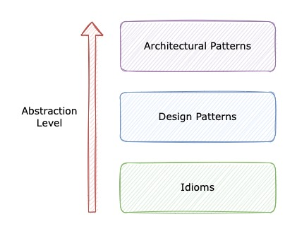
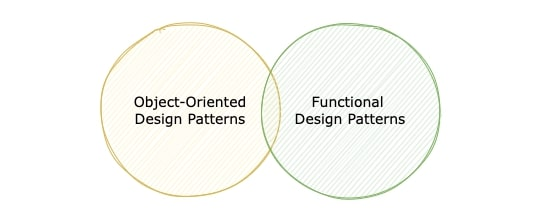

In the software industry, there are a range of topics you hear debates about in almost every company. I believe the 
design patterns story is one of them. You can find countless posts, articles, and Quora/Stackoverflow answers acting 
for or against them. For instance, the other day, I came across [this old Quora question](https://www.quora.com/Why-do-programmers-talk-less-about-design-patterns-now-Which-patterns-if-any-are-still-valuable):

> "Why do programmers talk less about design patterns now? Which patterns (if any) are still valuable?"

The author meant object-oriented design patterns, or the 23 patterns introduced in the [Gang of Four book](https://www.google.com/books/edition/Design_Patterns/tmNNfSkfTlcC?hl=en&gbpv=1&dq=Design+Patterns:+Elements+of+Reusable+Object-Oriented+Software&printsec=frontcover#v=onepage&q=Design%20Patterns:%20Elements%20of%20Reusable%20Object-Oriented%20Software&f=false), 
and most of the people who answered the question assumed that this was the case. However, 'the design pattern' is a term 
that some people use instead of 'object-oriented design patterns'-so don't get shocked when you come across the strange 
statement: "design patterns are dead".

In this article, we're going to answer a seemingly simple question: what is a design pattern? Answering this could help 
us determine what we're talking about while we're discussing or applying a particular design pattern.

## What do design patterns mean to you?
Let's put all the clichés aside and focus on what comes to your mind when thinking about the design pattern concept. 
Is it a rule that shouldn't be broken? Is it a wordy academic recommendation? Is it another design constraint? Or is it 
something you only need to know to pass job interviews?

To me, it's like a whispering sound in my head preventing me from reinventing the wheel. You may have experienced the 
urge to start the design/build process immediately after facing a problem and created your own solution-if so, 
welcome to the club. But in this scenario, if a solution already exists, creating another one just takes up unnecessary 
time and effort. Although the urge to jump straight into creating your own solution might settle over time, I believe 
that one of the crucial tools to help us overcome this urge is the design pattern concept.

A design pattern reminds me that many software engineers have already faced the same problem before and solved it in a 
particular way for several reasons. There's probably a rationale behind it and it gives us the ability to see the 
problem from a different perspective, even if we don't intend to follow that pattern.

Let's look at a paragraph from the [GoF famous book](https://www.google.com/books/edition/Design_Patterns/tmNNfSkfTlcC?hl=en&gbpv=1&dq=Design+Patterns:+Elements+of+Reusable+Object-Oriented+Software&printsec=frontcover#v=onepage&q=Design%20Patterns:%20Elements%20of%20Reusable%20Object-Oriented%20Software&f=false)'s introduction:

> "We all know the value of design experience. How many times have you had design déjà vu-that feeling that you've 
> solved a problem before but not knowing exactly where or how? If you could remember the details of the previous 
> problem and how you solved it, then you could reuse the experience instead of rediscovering it." 

More or less, we have experienced something similar: solving a common design problem several times when we couldn't 
remember the previous solution. Through reusing solutions to solve recurring problems, design patterns save time and 
effort, both of which can be directed elsewhere.

Now let's dive into some fundamental concepts and definitions.

## What do patterns mean?
What is a pattern? The pattern concept is not something specific to our industry. Other disciplines and industries such 
as architecture, economics, etc. also apply this concept. Let's see the pattern definitions by [Christopher Alexander](https://en.wikipedia.org/wiki/Christopher_Alexander), 
a leading authority in architecture:

> "Each pattern is a three-part rule, which expresses a relation between a certain context, a problem, and a solution." ([Alexander, 1979](https://www.google.com/books/edition/The_Timeless_Way_of_Building/H6CE9hlbO8sC?hl=en&gbpv=1&dq=The+Timeless+Way+of+Building&printsec=frontcover#v=onepage))
> 
> "Each pattern describes a problem which occurs over and over again in our environment, and then describes the core of the solution to that problem, in such a way that you can use this solution a million times over, without ever doing it the same way twice." ([Alexander, 1977](https://www.google.com/books/edition/A_Pattern_Language/FTpxDwAAQBAJ?hl=en&gbpv=1&dq=Pattern+language&printsec=frontcover#v=onepage&q&f=false))

Now let's see what patterns mean in the software industry:

> "A pattern for software architecture describes a particular recurring design problem that arises in specific design 
> contexts, and presents a well-proven generic scheme for its solution. The solution scheme is specified by describing 
> its constituent components, their responsibilities and relationships, and the ways in which they collaborate." 
> ([BMRSS, 96](https://books.google.nl/books/about/Pattern_Oriented_Software_Architecture_A.html?id=j_ahu_BS3hAC&printsec=frontcover&source=kp_read_button&hl=en&redir_esc=y#v=onepage&q&f=false))

Based on the above definitions, we can consider a pattern as a triad of context, problem, and solution combined with 
the relationship among them. However, it's a broad concept and can be applied to different scales and abstraction 
levels, from designing a whole software system, to solving a design problem belonging to a particular programming language.

## The different pattern categories
Patterns are classified based on their scale and abstraction level:

- Architectural patterns
- Design patterns
- Idioms

  

Architectural patterns focus on a whole software system structure, its subsystems, the different broad components and 
how they fit together. These patterns are at a high level of abstraction. For instance, they don't care what the 
programming language is or what framework is being used.

> "An architectural pattern expresses a fundamental structural organisation schema for software systems. It provides a 
> set of predefined subsystems, specifies their responsibilities, and includes rules and guidelines for organising the 
> relationships between them." ([BMRSS, 96](https://books.google.nl/books/about/Pattern_Oriented_Software_Architecture_A.html?id=j_ahu_BS3hAC&printsec=frontcover&source=kp_read_button&hl=en&redir_esc=y#v=onepage&q&f=false))

On the other hand, we have some patterns in the lowest level of abstraction called idioms which address both design and 
implementation. Idioms are language-specific meaning that an idiom in language A is irrelevant in language B.

> "An idiom is a low-level pattern specific to a programming language. An idiom describes how to implement particular 
> aspects of components or the relationships between them using the features of the given language." ([BMRSS, 96](https://books.google.nl/books/about/Pattern_Oriented_Software_Architecture_A.html?id=j_ahu_BS3hAC&printsec=frontcover&source=kp_read_button&hl=en&redir_esc=y#v=onepage&q&f=false))

However, there are still some other patterns that occur between those mentioned above regarding the scale and 
abstraction level, that's where design patterns come in.

## A closer look at design patterns
So let's review the definition of the remaining category:

> "A design pattern provides a scheme for refining the subsystems or components of a software system, or the 
> relationships between them. It describes a commonly-recurring structure of communicating components that solves a 
> general design problem within a particular context." ([BMRSS, 96](https://books.google.nl/books/about/Pattern_Oriented_Software_Architecture_A.html?id=j_ahu_BS3hAC&printsec=frontcover&source=kp_read_button&hl=en&redir_esc=y#v=onepage&q&f=false))

Design patterns are medium-scale, meaning they're neither highly abstract like architectural patterns, nor coupled to 
programming languages, like idioms. Applying design patterns doesn't affect the software system structure, but it does 
impact the subsystems' architecture and its smaller components.

Now, let's discuss the following statement (extracted from the same [reference](https://books.google.nl/books/about/Pattern_Oriented_Software_Architecture_A.html?id=j_ahu_BS3hAC&printsec=frontcover&source=kp_read_button&hl=en&redir_esc=y#v=onepage&q&f=false)) 
containing a crucial fact about design patterns:

> "They tend to be independent of a particular programming language or programming paradigm." ([BMRSS, 96](https://books.google.nl/books/about/Pattern_Oriented_Software_Architecture_A.html?id=j_ahu_BS3hAC&printsec=frontcover&source=kp_read_button&hl=en&redir_esc=y#v=onepage&q&f=false))

According to the pattern category we previously addressed in this article, we'd better rephrase it like this:

"They are independent of a particular programming language but **often** (not always) dependent on a programming paradigm."

The first part of the statement is clear: if a pattern is dependent on a specific programming language, it would be in 
the idioms category. Regarding the second part, design patterns are attempts to solve common problems that occur in 
programming paradigms. They're likely responses to the deficiencies of paradigms. For instance, there are 23 
object-oriented design patterns described in the GoF book, most of which are not genuine concerns in the functional 
programming paradigm. But the opposite is also true as the design patterns have different contexts.

As you can see in the [following image](https://blog.ploeh.dk/2012/05/25/Designpatternsacrossparadigms/), 
different paradigms could share design patterns, but we're not going to address this topic as it's beyond the scope of 
this article.

  

## Analysing a famous statement
With the previous sections in mind, let's have a quick look at a statement you may encounter when you simply google 
design patterns:

**Functional languages don't need design patterns.**

You can find a sample here. This statement is wrong as it implies design patterns only belong to the object-oriented 
paradigm. However, design patterns are a concept that can be present in both functional programming paradigm and 
object-oriented paradigm. The design patterns may just be specific to the problems and demands of the host paradigm. 
For instance, the functional programming paradigm has design patterns specific to its context.

Moreover, as we discussed in the previous sections, different paradigms have different contexts and consequently 
encounter different problems. We should not expect the design patterns of paradigm B to solve the problems of paradigm A.

## A quick recap
Design patterns, similar to other pattern types, try to solve recurring problems of a particular context.

- They're language-independent but mostly paradigm coupled.
- Being medium-scale, they are not as abstract as architectural patterns.
- Their application doesn't affect the fundamental architecture of the software system but influences the subsystems' architecture.
- Last but not least, they're (all types of patterns) means of preventing us from reinventing the wheel.

From my perspective, design patterns are not strict laws to constrain our design. They're neither fixed nor flawless as 
they could evolve and get better or even fade away, but the pattern concept still exists. To follow patterns is like a 
mindset that helps us figure out that there could be a better solution.
